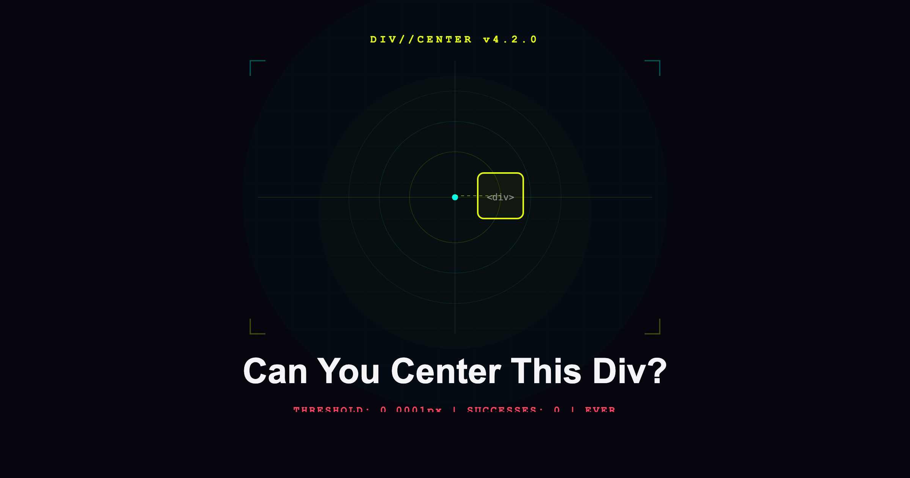

<p align="center">
  
</p>

<h1 align="center">Can You Center This Div?</h1>

<p align="center">
  <strong>The most over-engineered centering challenge on the internet.</strong><br/>
  Success threshold: 0.0001px. Global successes: 0. Ever.
</p>

<p align="center">
  <a href="https://center-this-div.vercel.app"><strong>Play Now</strong></a> &nbsp;|&nbsp;
  <a href="https://dev.to/devteam/join-our-april-fools-challenge-for-a-chance-at-tea-rrific-prizes-1ofa">DEV Challenge</a> &nbsp;|&nbsp;
  <a href="https://raxxo.shop">RAXXO Studios</a>
</p>

<p align="center">
  
  
  
  
  
  
</p>

---

## What Is This

Drag a `<div>` to the exact center of the screen. That's it.

The catch: the success threshold is **0.0001 pixels**, roughly 5,000x smaller than a single pixel on a Retina display. The global success counter reads 0. It will always read 0.

## The HUD

Because if you're going to fail at centering a div, you should fail beautifully.

- **Real-time deviation readouts** (X, Y, total distance) at 60fps
- **Precision meter** with logarithmic scale (INSANE / CLOSE / WARM / MEH / LOST)
- **Global leaderboard** tracking closest attempts worldwide
- **Live feed** showing recent attempts from other players
- **Radar sweep** with live player blips and pulsing glow
- **Earth Scale** mapping your pixel error to real-world distance
- **2,500+ unique quotes** based on how far off you are
- **Share cards** (1080x1080, 2x Retina) for every platform
- **418 teapot easter egg** (find it)
- **Light/dark mode**

When you submit, a HUD result card tells you your exact deviation to 6 decimal places, your global rank, and what your miss would mean if the target was Earth.

## Tech Stack

| Layer | Tech |
|---|---|
| Framework | Next.js 16 + React 19 |
| Language | TypeScript 5 |
| Database | Neon Postgres (serverless) |
| Icons | Phosphor Icons |
| Styling | Pure CSS (no animation libraries) |
| Drag | Pointer Events API |
| Share Cards | Canvas API |
| Deploy | Vercel |

## Running Locally

```bash
git clone https://github.com/raxxostudios/center-this-div.git
cd center-this-div
npm install
cp .env.example .env.local
# Add your Neon Postgres URL to .env.local
# Get a free database at neon.tech
npm run dev
```

Tables are created automatically on first load.

## API

| Route | Method | Description |
|---|---|---|
| `/api/init` | POST | Creates tables (idempotent) |
| `/api/challenge` | GET | Returns HMAC-signed gameplay token |
| `/api/submit` | POST | Records attempt, returns rank + percentile |
| `/api/leaderboard` | GET | Top 20 closest attempts all-time |
| `/api/stats` | GET | Global counters + recent attempts |
| `/api/cleanup` | GET | Cron-triggered leaderboard cleanup (every 10 min) |
| `/api/teapot` | GET | HTTP 418 |

## Anti-Cheat

Three layers, all returning HTTP 418 (I'm a Teapot):

- **HMAC gameplay proof.** Every submission requires a signed challenge token from `/api/challenge` plus a minimum pointer move count. Direct API calls without playing get the teapot.
- **Pattern analysis.** Exact zeros, sub-0.02px submissions, suspiciously round mantissas, and duplicate scores from the same browser are all rejected and earn strikes. 3 strikes = 1 hour IP ban with exploding teapot animation.
- **Cleanup cron (every 10 min).** Nukes entries below the 0.02px human floor, caps any single browser to 3 entries in the top 50 and 10 entries in the sub-0.1px range, and removes single-axis zero hits. The cron learns.

Rate limited: 1 submission per 2 seconds per IP. Browser zoom is disabled during gameplay.

## Earth Scale

Your pixel deviation mapped to real-world distance using Earth's circumference (40,075km).

2,500+ handwritten quotes across 164 distance tiers, from subatomic ("smaller than a virus") to planetary ("further than the Moon").

## Easter Eggs

There may or may not be a hidden teapot. It may or may not be made of 2,500 particles. It may or may not steam.

## Built For

[DEV April Fools 2026 Challenge](https://dev.to/devteam/join-our-april-fools-challenge-for-a-chance-at-tea-rrific-prizes-1ofa) (#418challenge)

## License

[MIT](LICENSE)

---

<p align="center">
  Built by <a href="https://raxxo.shop">RAXXO Studios</a><br/>
  <sub>Berlin. One-person AI creative studio.</sub>
</p>
